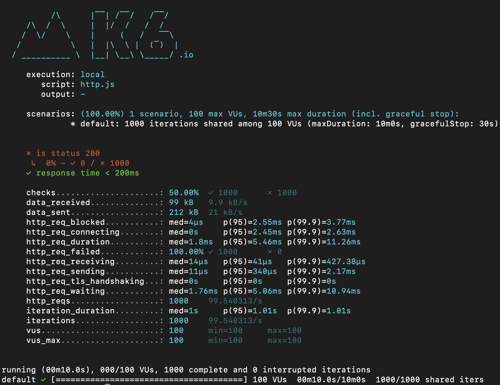
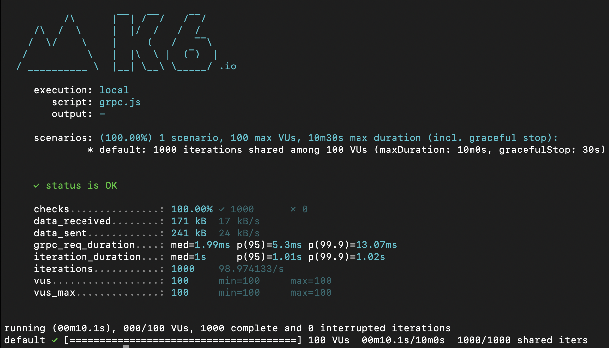
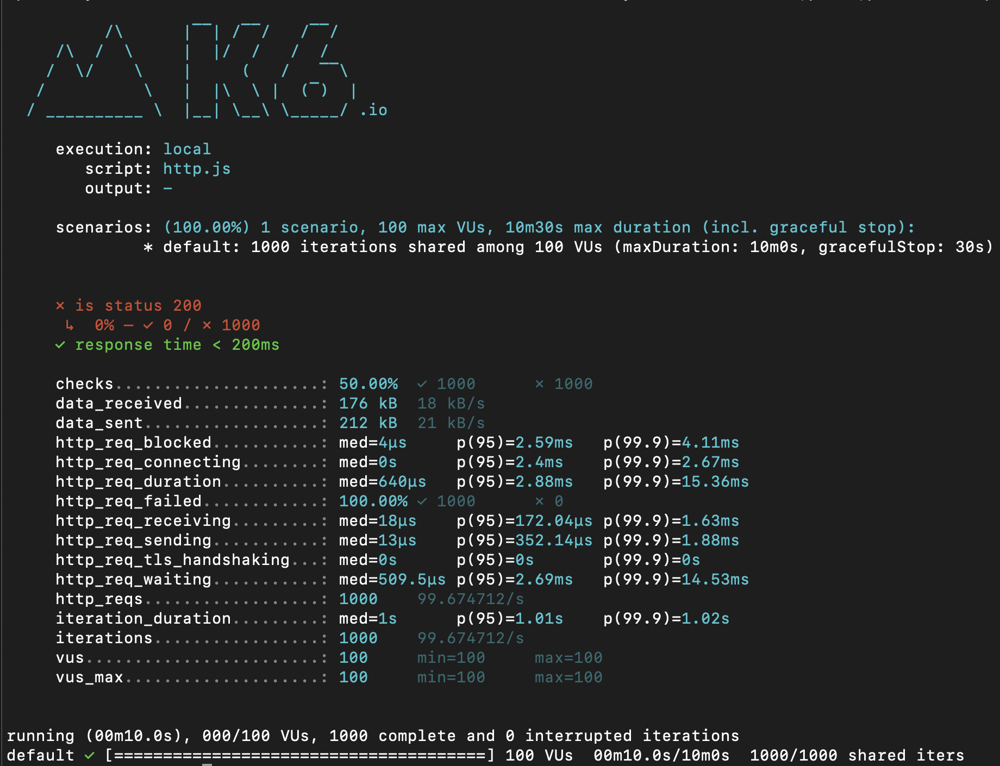
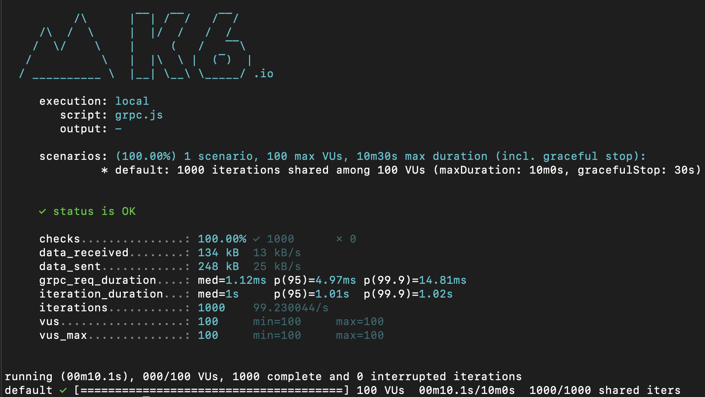

# Basic REST vs gRPC comparison


## Preface

This repository is an attempt to bust or not the following MYTHS.

1. **Myth**: gRPC is always faster than REST. While gRPC can be faster due to its use of HTTP/2 and binary serialization, the performance benefits depend highly on the specific use case and implementation details.
1. **Myth**: REST is more straightforward to implement than gRPC. Although REST's use of HTTP/1.1 and JSON might seem more straightforward, gRPC provides robust tools and language support that can simplify development, particularly for complex APIs with payload properties deprecation.


## What is inside

* This code is an attempt to compare plain REST vs gRPC services performance with GoLang vs .NET8. I didn't spend any time on profiling or trying to use "fancy" libraries. (Almost)
* Each service calculates the polygon surface
* To saturate each server implementation: 100 parallel clients, 1000 sequential requests per client


All runs are taken on Apple M2 pro chip. (ARM64)

Each run has similar outputs:
```shell
2024/05/20 22:58:10 gRPC Test completed in 1.124757041s
2024/05/20 22:58:10 gRPC Total requests: 100000
2024/05/20 22:58:10 gRPC Successful requests: 100000
2024/05/20 22:58:10 gRPC Failed requests: 0
2024/05/20 22:58:10 gRPC Success rate: 100.00%
2024/05/20 22:58:10 gRPC Failure rate: 0.00%
2024/05/20 22:58:10 gRPC Requests per second: 88908.089796
```

All runs completed with 100% success rate.

### Comparison Table

The table contains the Total time (in seconds) it took for the particular test to be completed.
Rows denote respective server implementation. Columns denote client-side implementation.

|                  | REST Golang | gRPC Golang | REST .NET8    | gRPC .NET8  | REST Golang (fastHTTP) |
|------------------|-------------|-------------|---------------|-------------|------------------------|
| REST Golang      |  1.89       |             |  2.03         |             |   1.72                 |
| gRPC Golang      |             | 1.08        |               |  2.30       |                        |
| REST .NET8       |  1.80       |             |  3.05         |             |   0.96                 |
| gRPC .NET8       |             | 1.46        |               |  3.07       |                        |


**Fastest Combinations:** The REST .NET8 server with the REST Golang (fastHTTP) client (0.96) and 
the gRPC Golang server with the gRPC Golang client (1.08) are the top-performing pairs, highlighting the efficiency of these specific combinations.

## Notable comments

* It's very ease to over saturate go-routines and get get REST client to run more than 120 seconds. Getting correct GoLang implementation took a bit of time.  
* Pure .NET8 implementation both REST and gRPC Clients performing equally similar


# K6 (Bonus)

Grafana k6 is an open-source load testing tool that makes performance testing easy and productive for engineering teams. k6 is free, developer-centric, and extensible.

## .NET8/REST 



## .NET8/gRPC 



## GoLang/REST 



## GoLang/gRPC


